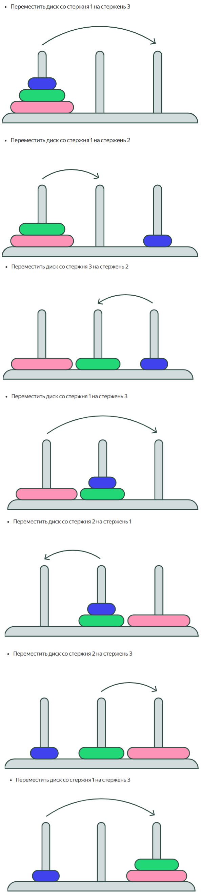

### Рекурсивные алгоритмы.
Рекурсия — одно из самых распространенных алгоритмических понятий. Если говорить просто, то рекурсивным алгоритм 
становится, если вызывает сам себя.

Головоломка Ханойские башни состоит из трёх стержней, пронумеруем их слева направо: 1, 2 и 3. Также в головоломке 
используется стопка дисков с отверстием посередине. Радиус дисков уменьшается снизу вверх. Изначально диски расположены 
на левом стержне (стержень 1), самый большой диск находится внизу. Диски в игре перемещаются по одному со стержня на 
стержень. Диск можно надеть на стержень, только если он пустой или верхний диск на нём большего размера, чем перемещаемый. 
Цель головоломки — перенести все диски со стержня 1 на стержень 3. Попробуйте нашу интерактивную версию Ханойских башен 
и узнайте, как переместить все диски с одного стержня на другой.
Решить головоломку с одним диском легко — просто переместите его на правый стержень. Головоломка на два диска ненамного сложнее. Сначала нужно переместить маленький диск на стержень посередине, а большой — на стержень справа. Затем переместить маленький диск на большой на правом стержне.



Рекурсивный алгоритм.
```
 HanoiTowers(n,fromPeg,toPeg)
    if n = 1:
        output “Move disk from peg fromPeg to peg toPeg”
        return
    unusedPeg = 6 - fromPeg - toPeg
    HanoiTowers(n−1,fromPeg,unusedPeg)
    output “Move disk from peg fromPeg to peg toPeg”
    HanoiTowers(n−1,unusedPeg,toPeg)
```