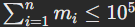

## Слияние сортированных последовательностей.

```
Ограничение времени 1 с
Ограничение памяти 256.0 Мб
Ввод стандартный ввод или input.txt
Вывод стандартный вывод или output.txt
```

Задано `n` отсортированных по неубыванию последовательностей.

Требуется найти отсортированную по неубыванию конкатенацию этих последовательностей.

### Формат ввода.
В первой строке задано одно число `n` `(1 ≤ n ≤ 20)` — количество отсортированных последовательностей.

Каждая из следующих последовательностей задано в формате: В первой строке `mi` `(1 ≤ mi ≤ 10^5)` — количество элементов 
последовательности.

Во второй сами элементы `ai` `(1 ≤ ai ≤ 10^9)`.

Гарантируется, что .

### Формат вывода.
В единственной строке выведите ответ на задачу.