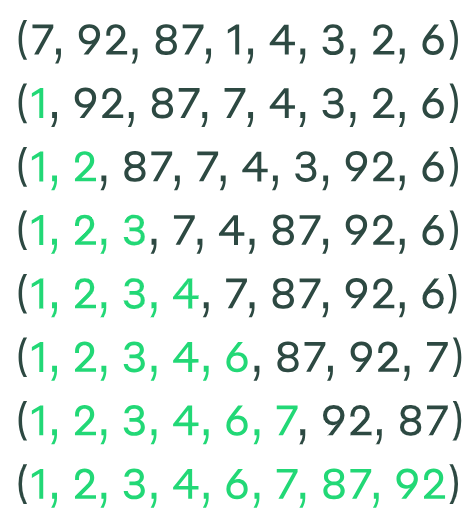
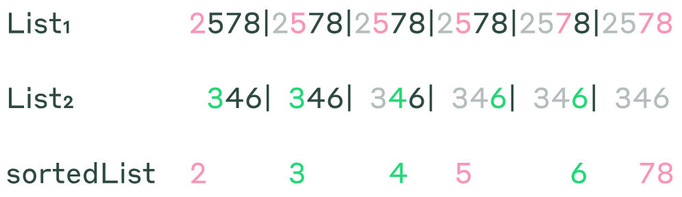
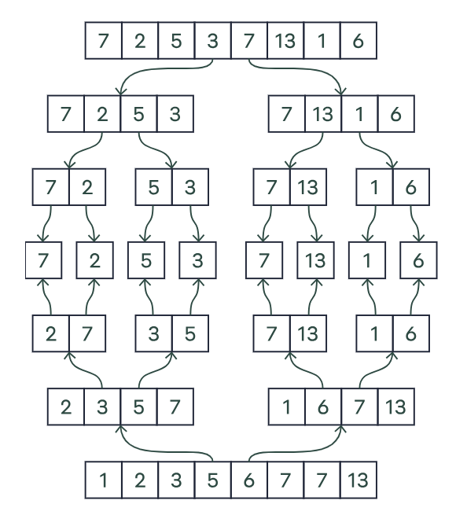

### Алгоритмы «Разделяй и властвуй».
Одна большая задача может казаться трудной. Но если разделить её на две задачи в два раза меньше, она станет намного 
проще. Для таких случаев хорошо подходят алгоритмы «разделяй и властвуй». Они так и работают: разделяют задачу на более 
мелкие подзадачи, независимо находят решения для них и соединяют результаты в решение изначальной задачи. Конечно, 
реальные ситуации бывают более сложными, чем мы описали. После разделения одной задачи на подзадачи, алгоритм обычно 
делит их на ещё более мелкие под-подзадачи и так далее. Он продолжает это делать, пока не дойдёт до точки, где в 
рекурсии уже нет необходимости. Важнейший шаг в работе с алгоритмами «разделяй и властвуй» — это соединить решения 
подзадач в решение изначальной задачи.

`SelectionSort` — это простой итерационный метод решения задачи по сортировке. Сначала он находит самый маленький элемент
`a`, а затем меняет его местами с первым элементом (то есть с `a1`). Затем он находит второй самый маленький элемент в `a` 
и переставляет его на второе место, меняя элемент местами с `a2`. Повторяя это действие в `i-й` раз, `SelectionSort` находит 
`i-й` самый маленький элемент в `a` и переставляет его на `i-е` место.

Если `a = (7, 92, 87, 1, 4, 3, 2, 6)`,
`SelectionSort(a)` будет состоять из следующих семи шагов:


`MergeSort` — классический пример алгоритма «разделяй и властвуй» для сортировки. Он намного быстрее, чем `SelectionSort`. 
Начнём с задачи слияния, в которой нам нужно будет объединить два отсортированных списка — `List1` и `List2` — в один 
отсортированный список.


Алгоритм `Merge` объединяет два отсортированных списка в один за время `O(|List1| + |List2|)`. Для этого алгоритм 
повторно выбирает самый маленький элемент из оставшихся в `List1` и `List2` и перемещает его в растущий отсортированный 
список.
```
Merge(List_1,List_2):
    SortedList = ... // пустой список
    while both List_1 and List_2 are non-empty:
    if the smallest element in List_1 is smaller than the smallest element in List_2:
        move the smallest element from List_1 to the end of SortedList
    else:
        move the smallest element from List_2 to the end of SortedList
    move any remaining elements from either List_1 or List_2 to the end of SortedList
    return SortedList
```

`Merge` — полезный инструмент для сортировки произвольного списка, если мы знаем, как разделить неотсортированный список 
на две отсортированные половины. Вам может показаться, что мы вернулись к тому, с чего начали, только теперь нам нужно 
отсортировать два меньших списка вместо одного большого. Но сортировка двух мелких списков — более предпочтительная 
алгоритмическая задача. Чтобы понять, почему это так, мы рассмотрим алгоритм `MergeSort`. Он разделяет неотсортированный 
список на две части и использует рекурсию для выполнения мелких задач перед тем, как объединить отсортированные списки.
```
MergeSort(List):
     if List consists of a single element:
        return List
     FirstHalf = first half of List
     SecondHalf = second half of List
     SortedFirstHalf = MergeSort(FirstHalf)
     SortedSecondHalf = MergeSort(SecondHalf)
     SortedList = Merge(SortedFirstHalf,SortedSecondHalf)
     return SortedList
```
