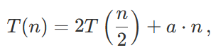
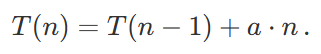

### Рандомизированные алгоритмы.
`QuickSort` выбирает элемент `m` (например, первый) из `c` и просто разделяет массив на два подмассива: `c small`
, в который входят все элементы в который входят все элементы `c` меньше `m`; и `c large`, в который входят все элементы
больше `m`.

Это разделение можно выполнить за линейное время, далее, следуя стратегии «разделяй и властвуй», QuickSort рекурсивно 
сортирует каждый подмассив. Итоговый отсортированный список может быть легко получен с помощью конкатенации отсортированного
`c small`, элемента `m` и отсортированного `c large`.

```
QuickSort(c):
    if |c| = 1: // только один элемент
    return c
    m = c[1] // возьмем первый элемент c
    // определим элементы c_small меньше m
    // определим элементы c_large больше m
    QuickSort(c_small)
    QuickSort(c_large)
    // объединим c_small, m и c_large в сортированный список c_sorted
    return c_sorted
```

Для данного подхода требуется выделить дополнительную память, в которой будут храниться массивы `c small` и `c large`. 
Лучший подход — переставить элементы входного массива на месте, чтобы набор `c small` шёл первым, затем `m`, а затем 
`c large` (см. ниже) — однако неясно, как это сделать.

Оказывается, что время выполнения `QuickSort` зависит от нашей удачи при отборе элемента `m`. Если мы выберем `m` так, 
что массив `c` разделяется на две равные части (то есть
`∣c small∣ = ∣c large∣`, тогда

где `T(n)` означает время, которое требуется QuickSort для сортировки массива из `n` чисел, и `a ⋅ n` означает время, 
которое потребуется для разделения массива длины `n` на две части; `a` — положительная константа. Это абсолютно такое же
рекуррентное соотношение, как и в `MergeSort`, соответствующее времени выполнения `O(nlogn)`.

Тем не менее если мы выберем `m` так, что `c` разделится неровно (например, возникает крайний случай, когда набор
`c small` пуст, а в наборе `c large n - 1` элементов), тогда рекуррентное соотношение будет


Это соотношение и приводит к времени выполнения `O(n2)`, а этого мы пытаемся избежать. Сортировка массива `(n, n−1, …, 2, 1)`
с помощью `QuickSort` действительно занимает квадратичное время. Что ещё хуже, на обработку `(1, 2, …, n−1, n)` требуется время
`O(n2)`. Это выглядит излишним, ведь массив уже отсортирован. 

Пока что алгоритм `QuickSort` похож на плохую имитацию `MergeSort`.
Однако если мы сможем выбрать хороший «разделитель» `m`, который разбивает массив на две равные части, мы сможем улучшить
время выполнения. На самом деле, не обязательно пытаться достичь идеального разделения (50/50), чтобы получить время выполнения
`O(nlogn)`. Например, также подойдет разделение на примерно равные части (скажем, 51/49). Фактически можно доказать, что
алгоритм будет иметь время выполнения `O(nlogn)` при условии, что оба набора `c small` и `c large` больше, чем `n / 4`.

Из этого следует, что из `n` возможных вариантов для `m`, выбранного в качестве элементов массива `c`, как минимум
`3n/4 - n/4 = n / 2` хорошо подойдут для разделения! Другими словами, если мы возьмем `m` случайным образом (вероятность
выбрать любой из элементов `c` одинакова), то у нас будет шанс 50% получить хорошее разделение. Такой вывод ложится в 
основу следующего вероятностного алгоритма:

```
RandomizedQuickSort(c):
     if |c| = 1: //  только один элемент
        return c
     m = ... // возьмем случайный элемент из c
     // определим элементы c_small меньше m
     // определим элементы c_large больше m
     RandomizedQuickSort(c_small)
     RandomizedQuickSort(c_large)
     // объединим c_small, m и c_large в сортированный список c_sorted
     return c_sorted
```

На практике `RandomizedQuickSort` — это быстрый алгоритм. Однако его худшее время выполнения остается `O(n 2)`, так как 
все еще есть вероятность, что он выберет плохой разделитель. При одном и том же вводе поведение вероятностного алгоритма
отличается от одного выполнения к другому. Тем не менее мы можем доказать, что его ожидаемое время выполнения —
`O(nlogn)`. Слово «ожидаемое» подмечает следующий эффект. Так как `RandomizedQuickSort` — это вероятностный алгоритм, 
два разных запуска (при одинаковом вводе) могут занять разное количество времени: некоторые будут быстрыми, некоторые — 
медленными. Таким образом, время выполнения вероятностного алгоритма — это случайная величина. Разработчики нередко 
интересуются средним значением этой случайной величины, что и называется ожидаемым временем выполнения. Можно 
продемонстрировать, что для каждого массива размером в `n` ожидаемое время выполнения `RandomizedQuickSort` будет `O(nlogn)`.

Главное преимущество вероятностных алгоритмов — это производительность. Вероятностные алгоритмы решают многие реальные 
задачи быстрее (с точки зрения ожидаемого времени выполнения), чем детерминированные алгоритмы. Еще одна привлекательная
особенность — это их простота. Она демонстрируется, например, в `RandomizedQuickSort`.

Мы подчеркиваем, что хотя `RandomizedQuickSort` и принимает решения случайным образом, он всегда выдаёт правильное 
решение задачи сортировки. Единственный изменяющийся параметр от одного прогона к другому — это время выполнения, но не 
результат. В противоположность этому, другие вероятностные алгоритмы обычно приводят к неправильным (или точнее, 
приблизительным) решениям. Вероятностные алгоритмы, которые всегда дают верные решения, называются Лас-Вегас. Алгоритмы,
которые не приводят к верным решениям — Монте-Карло.