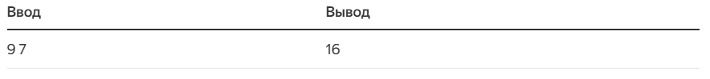

### Задача «Сумма двух чисел».
Рассмотрим совсем простую задачу.

- Входные данные: Целые числа `a` и `b` на одной строке (разделённые пробелом).
- Выходные данные: Сумма `a` и `b`. 
- Ограничения: `0 ≤ a`, `b ≤ 9`.
- Пример
<br/>

- Ограничение по времени (с): 1 секунда
- Ограничение по памяти: 512 Mb.

```
SumOfTwoDigits(a, b):
    return a + b
```

`C++`
```
#include <iostream>

int sum_of_digits(int first, int second) {
    return first + second;
}

int main() {
    int a = 0;
    int b = 0;
    std::cin >> a;
    std::cin >> b;
    std::cout << sum_of_digits(a, b);
    
```

`Java`
```
import java.util.Scanner;

class SumOfTwoDigits {
    static int sumOfTwoDigits(int first_digit, int second_digit) {
        return first_digit + second_digit;
    }

    public static void main(String[] args) {
        Scanner s = new Scanner(System.in);
        int a = s.nextInt();
        int b = s.nextInt();
        System.out.println(sumOfTwoDigits(a, b));
    }
}
```

`Python3`
```
def sum_of_digits(first_digit, second_digit):
    return first_digit + second_digit

if __name__ == '__main__':
    a, b = map(int, input().split())
    print(sum_of_digits(a, b))
```