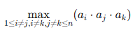

## Максимальное произведение трех чисел.

```
Ограничение времени 1 с
Ограничение памяти 256.0 Мб
Ввод стандартный ввод или input.txt
Вывод стандартный вывод или output.txt
```

Дана последовательность целых чисел `a1, ..., an`. Вычислите
<br/>



<br/>

Обратите внимание, что индексы `i`, `j` и `k` должны быть различны. Хотя в каких-то случаях значения элементов могут 
совпадать, то есть, например, `ai = aj`.

### Формат ввода.
Первая строка содержит целое число `n`. Следующая строка содержит `n` целых чисел `a1, ..., an` (разделены пробелами).

Ограничения: `3 ≤ n ≤ 2 * 10^5; −2 * 10^5 ≤ a1, ..., an ≤ 2 * 10^5`.

### Формат вывода.
Максимальное произведение трех элементов.