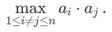
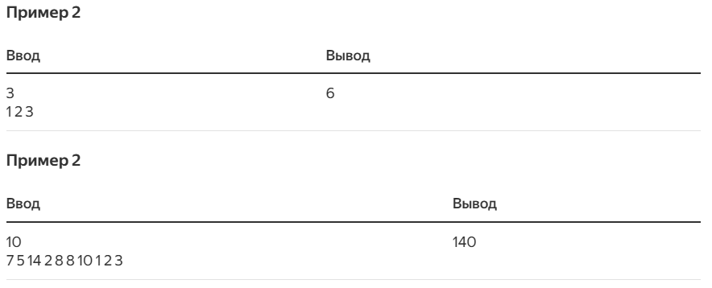

### Задача «Максимальное произведение».
Дана последовательность неотрицательных целых чисел `a1, …,an`. Вычислите
<br/>



<br/>

Обратите внимание, что `i` и `j` должны быть разными, хотя в каких-то случаях можно наблюдать, что `ai = aj`.

- Формат ввода: Первая строка содержит целое число `n`. Следующая строка содержит `n` неотрицательных целых чисел `a1, …, an`
(разделены пробелами).
- Формат вывода: Максимальное попарное произведение.
- Ограничения: `2 ≤ n ≤ 2 * 10^5; 0 ≤ a1, …, an ≤ 2 * 10^5`.
- Примеры
<br/>



<br/>

#### Наивный подход.
Наивный способ решить задачу `Максимальное произведение` — перебрать все возможные пары вводных элементов `A[1…n] = [a1, …, an]`
и найти пару, которая даёт наибольшее произведение.
```
MaxPairwiseProductNaive(A[1..n]):
    product = 0
    for i from 1 to n
        for j from 1 to n
            if i != j
                if product < A[i] * A[j]
                    product = A[i] * A[j]
    return product
```
Этот код можно оптимизировать и сократить следующим образом.
```
MaxPairwiseProductNaive(A[1..n]):
    product = 0
    for i from 1 to n
        for j from i+1 to n
            product = max(product, A[i] * A[j])
    return product
```

`C++`
```
#include <iostream>
#include <vector>
#include <algorithm>

int MaxPairwiseProduct(const std::vector<int>& numbers) {
    int max_product = 0;
    int n = numbers.size();

    for (int first = 0; first < n; ++first) {
        for (int second = first + 1; second < n; ++second) {
            max_product = std::max(max_product,
                numbers[first] * numbers[second]);
        }
    }

    return max_product;
}

int main() {
    int n;
    std::cin >> n;
    std::vector<int> numbers(n);
    for (int i = 0; i < n; ++i) {
        std::cin >> numbers[i];
    }

    std::cout << MaxPairwiseProduct(numbers) << "\n";
    return 0;
}
```

`Java`
```
import java.util.*;
import java.io.*;

public class MaxPairwiseProduct {
    static int getMaxPairwiseProduct(int[] numbers) {
        int max_product = 0;
        int n = numbers.length;

        for (int first = 0; first < n; ++first) {
            for (int second = first + 1; second < n; ++second) {
                max_product = Math.max(max_product,
                    numbers[first] * numbers[second]);
            }
        }

        return max_product;
    }

    public static void main(String[] args) {
        FastScanner scanner = new FastScanner(System.in);
        int n = scanner.nextInt();
        int[] numbers = new int[n];
        for (int i = 0; i < n; i++) {
            numbers[i] = scanner.nextInt();
        }
        System.out.println(getMaxPairwiseProduct(numbers));
    }

    static class FastScanner {
        BufferedReader br;
        StringTokenizer st;

        FastScanner(InputStream stream) {
            try {
                br = new BufferedReader(new
                    InputStreamReader(stream));
            } catch (Exception e) {
                e.printStackTrace();
            }
        }

        String next() {
            while (st == null || !st.hasMoreTokens()) {
                try {
                    st = new StringTokenizer(br.readLine());
                } catch (IOException e) {
                    e.printStackTrace();
                }
            }
            return st.nextToken();
        }

        int nextInt() {
            return Integer.parseInt(next());
        }
    }

}
```

`Phyton`
```
def max_pairwise_product(numbers):
    n = len(numbers)
    max_product = 0
    for first in range(n):
        for second in range(first + 1, n):
            max_product = max(max_product,
                numbers[first] * numbers[second])

    return max_product


if __name__ == '__main__':
    _ = int(input())
    input_numbers = list(map(int, input().split()))
    print(max_pairwise_product(input_numbers))
```

После проверки вы можете увидеть такое сообщение:
<br/>
`Failed case #4/17: time limit exceeded`

#### Быстрый алгоритм.

```
MaxPairwiseProductFast(A[1..n]):
    index_1 = 1
    for i from 2 to n
        if A[i] > A[index_1]
            index_1 = i
    index_2 = 1
    for i from 2 to n
        if A[i] != A[index_1] and A[i] > A[index_2]
            index_2 = i
    return A[index_1] * A[index_2]
```

#### Тестирование и отладка.

```
MaxPairwiseProductFast(A[1..n]):
    index_1 = 1
    for i from 2 to n
        if A[i] > A[index_1]:
            index_1 = i
    if index_1 = 1
        index_2 = 2
    else:
        index_2 = 1
    for i from 1 to n
        if A[i] != A[index_1] and A[i] > A[index_2]
            index_2 = i
    return A[index_1] * A[index_2]
```

Вывод:
```
2  
100000 90000
```

#### А в чем ошибка?
Вероятно, вас интересует, почему мы не предоставили 5-й набор данных из 17 — тот, который привел к сбою программы? 
Причина проста: в реальности вам не будут показывать тестовые примеры.

Даже опытные программисты при решении задач с алгоритмами часто совершают ошибки, которые трудно обнаружить. Поэтому 
важно научиться находить баги как можно раньше. Когда авторы этой книги только начинали программировать, они ошибочно 
полагали, что почти все их программы правильные. Сейчас же мы знаем, что при первом запуске наши программы почти никогда 
не верны.

Когда разработчик уверен в работе своей программы, он зачастую использует всего лишь несколько примеров для тестирования.
Если результаты выглядят приемлемо, он считает свою работу законченной — но это путь к катастрофе. Если вы хотите убедиться,
что ваша программа работает всегда, то советуем тщательно подобрать примеры для тестирования. Реализация алгоритмов, а 
также их тестирование и отладка будут бесценным навыком для вашей будущей карьеры программиста.

#### Стресс-тестирование.
`Сресс-тестирование` -  техника, которая позволяет генерировать тысячи тестовых сценариев. С её помощью можно найти тот,
из-за которого провалилось ваше решение.

Стресс-тестирование состоит из четырёх частей:
- Реализация алгоритма. 
- Альтернативная, банальная и медленная, но правильная реализация алгоритма для той же самой задачи.
- Генератор случайных тестов.
- Бесконечный цикл, генерирующий тесты и передающий их обоим вариантам реализации для сравнения результатов. Если результаты
разнятся, выводятся оба результата и пример для тестирования, а программа останавливается. В ином случае цикл повторяется.

Стресс-тестирование основано на идее, что две правильных реализации с каждым тестом должны приводить к одному ответу 
(при условии, что ответ на задачу уникален). Однако если одна из реализаций неправильна, должен существовать такой тест,
который приводит к разным ответам. Единственный случай, при котором это не так, — когда в обеих реализациях есть одна и 
та же ошибка. Но это маловероятно — если ошибка не где-то в программе ввода/вывода, общей для обоих решений. Действительно,
если одно решение правильно, а другое — нет, то существует сценарий тестирования, при котором они различаются. Если оба 
решения неверны, но баги отличаются — скорее всего, есть тест, при котором два решения дают разные результаты.

Продемонстрируем стресс-тестирование `MaxPairwiseProductFast`, используя `MaxPairwiseProductNaive` в качестве тривиальной
реализации:
```
StressTest(N, M):
    while true:
        n = ... // случайное целое число между 2 и N
        // создать массив A[1..n]
        for i from 1 to n
            A[i] = ... // случайное целое число между 0 и M
        print(A[1..n])
        result_1 = MaxPairwiseProductNaive(A)
        result_2 = MaxPairwiseProductFast(A)
        if result_1 = result_2:
            print("OK")
        else:
            print("Wrong answer:", result_1, result_2)
            return
```
Представленный выше цикл `while` сначала генерирует длину вводной последовательности `n`, случайное число между `2` и `N`. 
Оно должно быть не менее `2`: формулировка задачи гласит, что `n ≥ 2`. Параметр `N` должен быть достаточно маленьким, 
чтобы позволить нам рассмотреть множество тестов, несмотря на то, что наши решения медленные.

Сгенерировав `n`, мы генерируем массив `A` с `n` целыми числами от `0` до `M` и выводим его, чтобы по ходу бесконечного 
цикла мы всегда знали, какой тест проходит сейчас. Это упростит нахождение ошибок в коде для генерации теста. Затем мы 
вызываем два алгоритма для `A` и сравниваем результаты. Если результаты отличаются, мы их печатаем и останавливаемся. В 
ином случае мы продолжаем цикл `while`.

Запуск `StressTest(10, 100'000)`:
```
...  
OK  
67232 68874 69499  
OK  
6132 56210 45236 95361 68380 16906 80495 95298  
OK  
62180 1856 89047 14251 8362 34171 93584 87362 83341 8784  
OK  
21468 16859 82178 70496 82939 44491  
OK 
68165 87637 74297 2904 32873 86010 87637 66131 82858 82935  
Wrong answer: 7680243769 7537658370
```

Генерация тестового примера поменьше. `N = 5, M = 9`:
```
...  
7 3 6  
OK  
2 9 3 1 9  
2 3  
Wrong answer: 81 27  
```
`MaxPairwiseProductNaive  = 81` - Верно.
`MaxPairwiseProductFast = 27` - Не верно.

Вместо сравнения `i` и `index1` мы сравнили `A[i]` и `A[index]`.

Пример более надежного способа реализации алгоритма:
```
MaxPairwiseProductFast(A[1..n]):
    index = 1
    for i from 2 to n
        if A[i] > A[index]:
            index = i
    swap(A[index], A[n]) // поставим наибольшее значение в конец массива
    index = 1:
    for i from 2 to n - 1
        if A[i] > A[index]:
            index = i
    swap(A[index], A[n - 1]) // поставим второй по величине элемент предпоследним
    return A[n - 1] * A[n]
```

#### Более компактный алгоритм.
```
MaxPairwiseProductBySorting(A[1..n]):
    Sort(A)
    return A[n-1]*A[n]
```
