### Задачи о числах Фибоначчи.
#### Числа Фибоначчи.
<br/>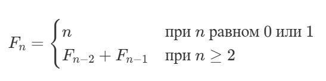<br/>

```
Fibonacci(n):
     if n <= 1:
        return n
     else:
        return Fibonacci(n−2)+Fibonacci(n−1)
```

Рассмотрим совсем простую задачу.

- Входные данные: Целое число `n`.
- Выходные данные: `Fn`.
- Ограничения: `0 ≤ n ≤ 45`.
- Примеры
<br/>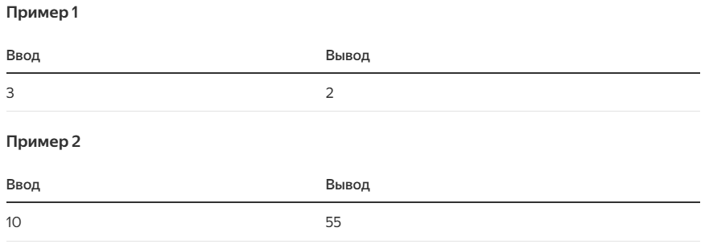<br/>

#### Решение 1: Рекурсивный алгоритм.
```
def fibonacci(n):
    if n <= 1:
        return n
    else:
        print(f'Computing F{n} recursively...')
        return fibonacci(n - 2) + fibonacci(n - 1)


print(fibonacci(7))
```
```
Computing F7 recursively...
Computing F5 recursively...
Computing F3 recursively...
Computing F2 recursively...
Computing F4 recursively...
Computing F2 recursively...
Computing F3 recursively...
Computing F2 recursively...
Computing F6 recursively...
Computing F4 recursively...
Computing F2 recursively...
Computing F3 recursively...
Computing F2 recursively...
Computing F5 recursively...
Computing F3 recursively...
Computing F2 recursively...
Computing F4 recursively...
Computing F2 recursively...
Computing F3 recursively...
Computing F2 recursively...
13
```

#### Решение 2: Итерационный алгоритм.
<br/>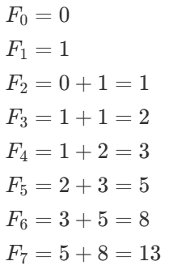<br/>

```
Fibonacci(n):
    if n <= 1:
        return n
    allocate an array F[0..n]
    F[0] = 0
    F[1] = 1
    for i from 2 to n:
        F[i] = F[i − 2] + F[i − 1]
    return F[n]
```
```
Fibonacci(n):
    if n <= 1:
        return n
    previous = 0
    current = 1
    for iter in range(n-1):
        oldPrevious = previous
        previous = current
        current = oldPevious + previous
    return current
```

#### Решение 3: Запоминание.
`Мемоизация`: при вычислении чего-либо сохраните это в структуре данных, чтобы избежать повторных вычислений в будущем.
```
table — некоторый ассоциативный контейнер (в table[i]  будем сохранять F[i])

Fibonacci(n):
    if table[n] ещё не вычисляли:
        if n <= 1:
            table[n] = n
        else:
            table[n] = Fibonacci(n−2)+Fibonacci(n−1)
    return table[n]
```

### Последняя цифра числа Фибоначчи.
- Формат ввода: Целое число `n`.
- Формат вывода: Последняя цифра `Fn`.
- Ограничения: `0 ≤ n ≤ 10^6`.
- Примеры
<br/>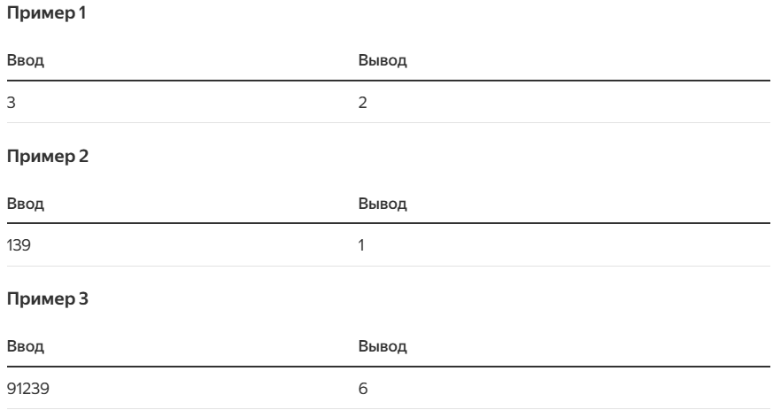<br/>

#### Решение: Взять каждое промежуточное звено по модулю 10.
```
FibonacciLastDigit(n):
    if n <= 1:
        return n
    F[0..n] — массив для промежуточных значений
    F[0] = 0
    F[1] = 1
    for i from 2 to n:
        F[i] = F[i − 1] + F[i − 2]
    return F[n] mod 10
```
```
FibonacciLastDigit(n):
    if n <= 1:
        return n
    F[0..n] — массив для промежуточных значений
    F[0] = 0
    F[1] = 1
    for i from 2 to n:
        F[i] = (F[i − 1] + F[i − 2]) mod 10
    return F[n]
```

#### Огромное число Фибоначчи.
<br/>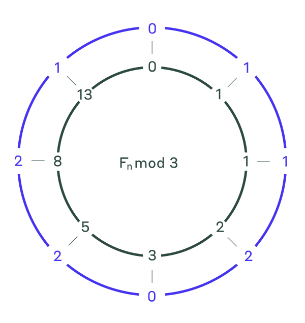<br/>

- Формат ввода: Целые числа `n` и `m`.
- Формат вывода: `Fn mod m`.
- Ограничения: `1 ≤ n ≤ 10^14,2 ≤ m ≤ 10^3`.
- Примеры
<br/>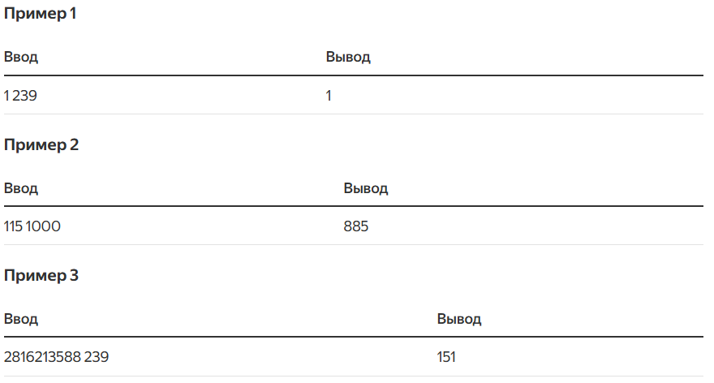<br/>

Предупреждение:
- `F1 mod 239 = 1 mod 239 = 1`. 
- `F115 mod 1000 = 483162952612010163284885 mod 1000 = 885`.
- `F2816213588` содержит миллионы цифр, но `F2816213588 mod 239 = 151`.

#### Решение 1: Период Пизано.
<br/>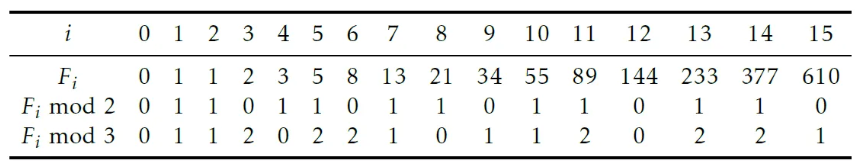<br/>
<br/>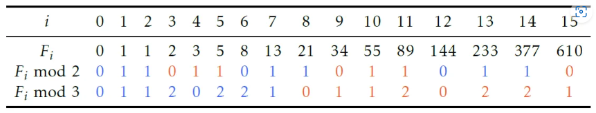<br/>
Чтобы вычислить, например, `F2015 mod 3`, нам понадобится найти остальную часть `2015` при делении на `8`. Так как 
`2015 = 251 * 8 + 7`, мы можем заключить, что `F2015 mod 3 = F7 mod 3 = 1`. Оказывается, что для любого целого числа
`m ≥ 2` последовательность `Fn mod m` будет периодической. Период всегда начинается с `01`. Он называется период Пизано 
(Фибоначчи также называют Пизано).
<br/>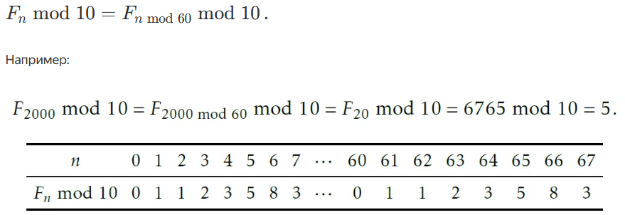<br/>
Чтобы доказать, что последние цифры чисел Фибоначчи периодические, обратите внимание на пары остатков по модулю `m`, 
следующих друг за другом чисел Фибоначчи:
<br/>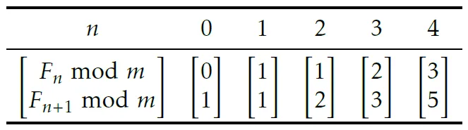<br/>
Каждую из колонок таблицы можно вычислить на основе предыдущей колонки
<br/>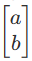<br/>
как
<br/>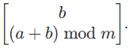<br/>
По такой же логике колонка перед колонкой
<br/>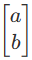<br/>
будет
<br/>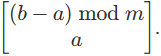<br/>
Следовательно, для любой колонки в таблице выше можно однозначно определить соседей слева и справа. А значит, из любой 
позиции можно заполнить всю таблицу.

Поскольку остатков по модулю `m` только `m`, есть только `m^2` возможных пар остатков, то есть максимум `m^2` возможных 
колонок. Таким образом, некоторые колонки в таблице повторяются и будут это делать до бесконечности.
<br/>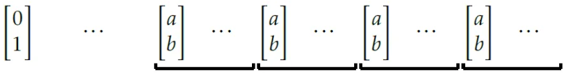<br/>

```
PisanoPeriod(m):
    current = 0
    next = 1
    period = 0
    while True:
        oldNext = next
        next = (current + next) mod m
        current = oldNext
        period = period + 1
        if current = 0 and next = 1:
            return period
```

#### Решение 2: Быстрое возведение матрицы в степень.
<br/>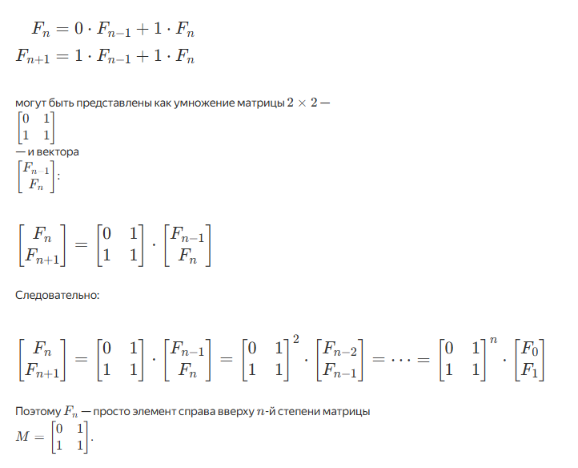<br/>

```
FastIntegerExponentiation(x, n):
    if n = 0:
        return 1
    if n % 2 == 0: # чётное значение
        y = FastIntegerExponentiation(x, n/2)
        return y * y 
    else: # нечётное значение
        y = FastIntegerExponentiation(x, (n−1)/2)
        return y * y * x
```
```
FastMatrixExponentiation(D, n, m):
    if n = 0:
        return [[1, 0], [0, 1]] # единичная 2×2 матрица
     if n % 2 == 0: # чётное значение
        Y = FastMatrixExponentiation(D, n/2, m)
        return Multiply2x2Matrices(Y, Y, m)
     else:
        Y = FastMatrixExponentiation(D, (n−1)/2, m)
        Y2 = Multiply2x2Matrices(Y, Y, m)
        return Multiply2x2Matrices(Y2, D, m)
```
```
Multiply2x2Matrices(A, B, m):
	  C[1][1] = (A[1][1]*B[1][1] + A[1][2]*B[2][1]) mod m
	  C[1][2] = (A[1][1]*B[1][2] + A[1][2]*B[2][2]) mod m
	  C[2][1] = (A[2][1]*B[1][1] + A[2][2]*B[2][1]) mod m
	  C[2][2] = (A[2][1]*B[1][2] + A[2][2]*B[2][2]) mod m
	  return C
```
```
FibonacciModuloM(n, m):
	M = [[0, 1], [1, 1]]
	P = FastMatrixExponentiation(M, n, m)
	return P[0][1]
```

### Последняя цифра суммы чисел Фибоначчи.
- Формат ввода: Целые числа `m` и `n`.
- Формат вывода: `(Fm + Fm+1 + ... + Fn) mod 10`.
- Ограничения: `0 ≤ m ≤ n ≤ 10^14`.
- Примеры
<br/>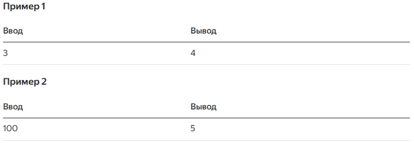<br/>

#### Решение.
В таблице ниже указаны первые одиннадцать чисел Фибоначчи и первые одиннадцать чисел `Sn = F0 + F1 + ... + Fn`.
<br/>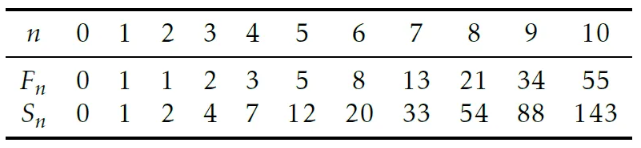<br/>

### Последняя цифра частичной суммы чисел Фибоначчи.
- Формат ввода: Целое число `n`. 
- Формат вывода: `(F0 + F1 + ... + Fn) mod 10`.
- Ограничения: `0 ≤ n ≤ 10^14`.
- Примеры
<br/>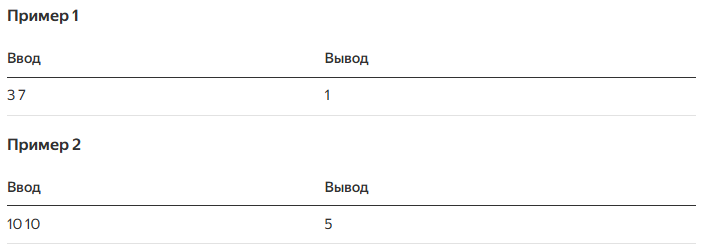<br/>

#### Решение.
<br/>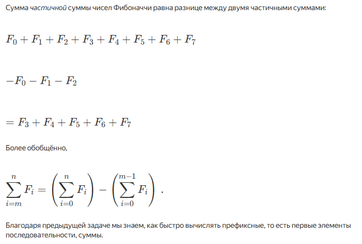<br/>

### Последняя цифра суммы квадратов чисел Фибоначчи.
<br/>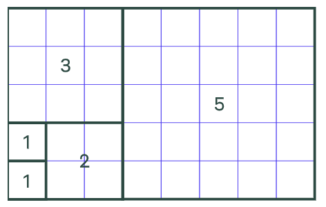<br/>
- Формат ввода: Целое число `n`.
- Формат вывода: `F0^2 + F1^2 + ... + Fn^2) mod 10`.
- Ограничения: `0 ≤ n ≤ 10^14`.
- Примеры
<br/>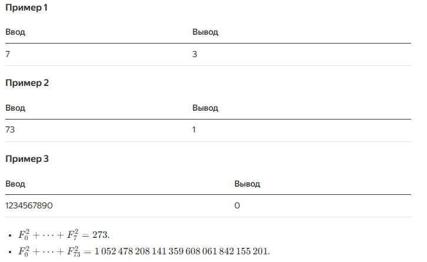<br/>
#### Решение.
<br/>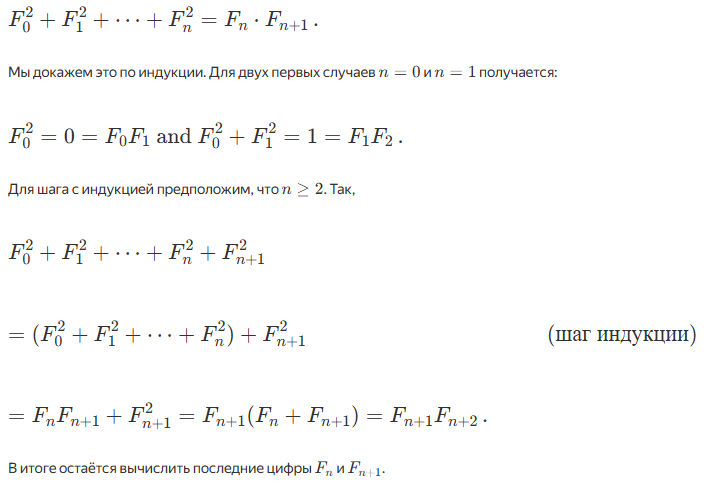<br/>