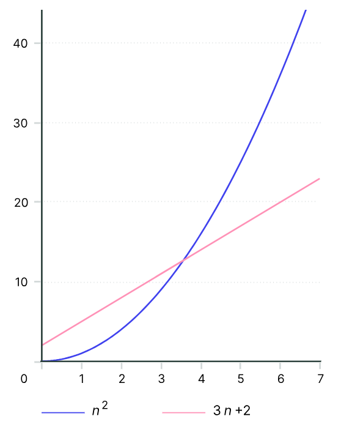

### Что такое алгоритм?
Алгоритм — это последовательность указаний, которые нужно исполнить, чтобы решить чётко сформулированную задачу. 
Мы описываем задачи исходя из ввода и вывода, и алгоритм становится способом превращения ввода в вывод. При этом 
формулировка задачи должна быть точной и недвусмысленной — это помогает избежать неверной интерпретации.
Когда вы закончили проектировать алгоритм, необходимо ответить на два важных вопроса: «Правильно ли он работает?» и 
«Сколько времени занимает выполнение?». Разумеется, вас не устроит алгоритм, который выдаёт правильный результат лишь 
в половине случаев или требует 1 000 лет для поиска ответа.

### Псевдокод.
Псевдокод — язык, которым пользуются разработчики для описания алгоритмов. Он игнорирует многие детали, необходимые в 
языках программирования, но он более точен, чем рецепт из кулинарной книги.

### Задача и экземпляр задачи.
Задача описывает класс возможных входных данных. Экземпляр задачи — это один конкретный ввод такого класса.

### Условие:
Вы оказались в книжном магазине и собираетесь купить книгу за 4,23＄, расплатившись купюрой в 5＄. Вам должны вернуть
77 центов в качестве сдачи. Теперь кассир принимает решение, как именно это сделать. Согласитесь, неприятно получить
горсть из 77 пенни или 15 никелей и 2 пенни. Возникает вопрос: как выдать сдачу, не расстроив клиента?
Большинство кассиров стараются уместить сумму сдачи в наименьшее количество монет.

Пример с 77 центами представляет собой экземпляр задачи `Change`. Предполагается, что есть `d` номиналов, которые 
представлены массивом `c = (c1, c2, …, cd)`. Для упрощения будем считать, что номиналы даны в порядке убывания. Например,
`c = (25, 10, 5, 1)` для монет, используемых в США.

`Задача «Change»`
<br/>
Переведите определенное количество денег в данные номиналы, используя как можно меньше монет.
- Входные данные: Целое число `money` и массив из `d` номиналов `c = (c1, c2, …, cd)` в порядке убывания `(с1 > c2 > ... > cd)`.
- Выходные данные: Список из d целых чисел `i1, i2, ..., id`, в котором `c1 * i1 + c2 * i2 + ... + cd * id = money` и 
`i1 + i2 + ... + id` как можно меньше.

Кассиры по всему миру решают эту проблему с помощью простого алгоритма:
```
Change(money, c, d):
    while money > 0:
        coin = ... // монета с самым большим номиналом, который не превышает money
        // дать монету с номиналом coin клиенту
        money = money - coin
```

Вот быстрая версия `Change`:
```
Change(money, c, d):
    for k in range(1, d + 1) 
        i_k = floor(money / c[k]) // наибольшее количество монет номинала c[k]
        // дать i_k монет с номиналом c[k] клиенту
        money = money - c[k] * i_k
```

### Корректные и некорректные алгоритмы.
Мы называем алгоритм корректным, если на каждый получаемый ввод он делает правильный вывод. Алгоритм считается 
некорректным, если хотя бы один ввод приводит к неправильному выводу.

```
BruteForceChange(money, c, d):
    smallestNumberOfCoins = ∞
    for each combinations of coins (i_1,...,i_d)
    // от (0,...,0) до (money/c[1],...,money/c[d])
        valueOfCoins = ∑ i_k*c_k // сумма по всем k от 1 до d
        if valueOfCoins = money:
            numberOfCoins = ∑ i_k // суммарное количество монет
            if numberOfCoins < smallestNumberOfCoins:
                smallestNumberOfCoins = numberOfCoins
                change = (i_1, i_2, ... ,i_d)
    return change
```

### Быстрые и медленные алгоритмы.

Представьте, что алгоритм `A` выполняет `n^2` операций при вводе размера n, и алгоритм `B` решает ту же задачу за `3n + 2`
операций. Какой алгоритм быстрее: `A` или `B`? Хотя `A` и может быть быстрее, чем `B`, при более малом значении `n`
(например, при `n` между 1 и 3), `B` будет быстрее при больших значениях `n` (например, `n` > 4. Так как `f(n) = n^2`
— это, в каком-то смысле, более «быстрорастущая» функция относительно `n`, чем `g(n) = n`. При этом константы 3 и 2 в
`3n + 2` не влияют на конкуренцию между двумя алгоритмами при больших значениях `n`. Мы называем `A` квадратичным алгоритмом и
`B` — линейным. `A` менее эффективен, чем`B`, потому что он выполняет больше операций для решения задачи, когда значение
`n` большое. Так, иногда мы будем допускать неточности при подсчете операций алгоритма: поведение алгоритма при 
маленьком вводе неважно.

